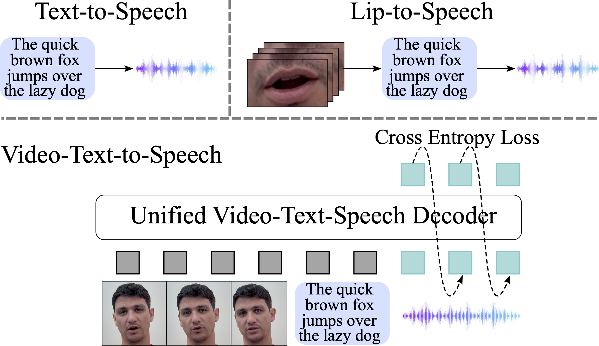

# Visatronic: A Multimodal Decoder-Only Model for Speech Synthesis

This repository accompanies the research paper **[Visatronic: A Multimodal Decoder-Only Model for Speech Synthesis](https://arxiv.org/abs/2411.17690)** by *Gupta, Akshita, and Likhomanenko, Tatiana and Yang, Karren, and Bai, He and Aldeneh, Zakaria and Jaitly, Navdeep* on speech generation from text and video.

## Abstract

In this paper, we propose a new task - generating speech from videos of people and their transcripts (VTTS) - to motivate new techniques for multimodal speech generation.
This task generalizes the task of generating speech from cropped lip videos, and is also more complicated than the task of generating generic audio clips (e.g., dog barking) from videos and text.
Multilingual versions of the task could lead to new techniques for cross-lingual dubbing.
We also present a decoder-only multimodal model for this task, which we call Visatronic. 
This model embeds vision, text and speech directly into the common subspace of a transformer model and uses an autoregressive loss to learn a generative model of discretized mel-spectrograms conditioned on speaker videos and transcripts of their speech.
By embedding all modalities into a common subspace, Visatronic can achieve improved results over models that use only text or video as input.
Further, it presents a much simpler approach for multimodal speech generation compared to prevailing approaches which rely on lip-detectors and complicated architectures to fuse modalities while producing better results.
Since the model is flexible enough to accommodate different ways of ordering inputs as a sequence, we carefully explore different strategies to better understand the best way to propagate information to the generative steps.
To facilitate further research on VTTS, we will release (i) our code, (ii) clean transcriptions for the large-scale VoxCeleb2 dataset, and (iii) a standardized evaluation protocol for VTTS incorporating both objective and subjective metrics.

<p align="center">
  <a href="./assets/overview.png">
    
  </a>
</p>


## Generated Samples

The repository provides examples of the generated speech for models trained on [VoxCeleb2 dataset](https://www.robots.ox.ac.uk/~vgg/data/voxceleb/vox2.html):
we show both success and failure cases. The samples can be played [here](https://apple.github.io/visatronic-demo/).

To overlay generated speech with original speakers' video, please follow:
- download VoxCeleb2 data from [here](https://www.robots.ox.ac.uk/~vgg/data/voxceleb/vox2.html)
- install dependencies
```bash
apt-get install ffmpeg
pip install moviepy
```
- run script
```bash
# PATH_TO_SPEECH_FOLDER - e.g. "audio_samples/success_cases/VTTS_VT_ordered"
python run_speech_overlap_video.py [PATH_TO_VOXCELEB2_VIDEO_DIR] [PATH_TO_SPEECH_FOLDER] [OUTPUT_DIR]
```


## License

- Repository is released under [LICENSE](LICENSE). 
- All generated speech samples provided here are licensed under [LICENSE-speech-samples.md](LICENSE-speech-samples.md).


## Citations

```
@article{gupta2024visatronic,
  title={Visatronic: A Multimodal Decoder-Only Model for Speech Synthesis},
  author={Gupta, Akshita, and Likhomanenko, Tatiana and Yang, Karren, and Bai, He and Aldeneh, Zakaria and Jaitly, Navdeep},
  journal={arXiv preprint arXiv:2411.17690},
  year={2024}
}
```
